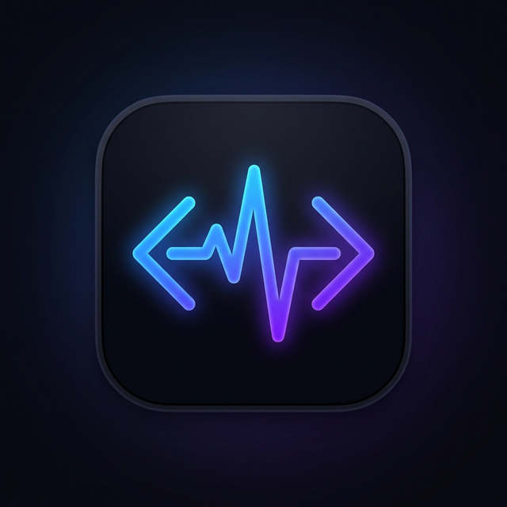

<div align="center">
  
  <h1>DevPulse</h1>
  <p><strong>Your Developer Productivity Command Center</strong></p>
  <p>
    <a href="https://github.com/notkoushik/DevPulse/actions"></a>
    <a href="https://devpulse-8gkb.onrender.com/api/health"></a>
    
    
    
  </p>
</div>

---

## 📖 About

**DevPulse** is a cross-platform mobile application that consolidates a developer's activity across multiple platforms into a single, beautifully designed dashboard. Track your GitHub contributions, LeetCode progress, WakaTime coding hours, and stay up-to-date with AI-powered tech news summaries — all from one app.

Built with **Flutter** for the frontend and a **Node.js/Express** backend, DevPulse is designed with a production-grade architecture including automated CI/CD, secure authentication, and intelligent background workers.

---

## ✨ Features

### 📊 Unified Dashboard
A single screen showing your key developer metrics at a glance — contributions, coding time, streak counts, and weekly progress charts.

### 🐙 GitHub Integration
- View contribution streaks, total commits, and repository stats
- Visualize your contribution activity over time
- Track stars, forks, and language breakdowns

### 💻 LeetCode Tracker
- Monitor problems solved by difficulty (Easy, Medium, Hard)
- Track your acceptance rate and contest rating
- View submission history and progress trends

### ⌨️ WakaTime Analytics
- Daily and weekly coding time breakdowns
- Language and project distribution charts
- Coding activity heatmaps and trends

### 🤖 AI-Powered Features
- **AI Chat**: An integrated AI assistant powered by Gemini/Groq for developer Q&A
- **Smart News Digest**: Background workers automatically fetch tech news from RSS feeds and generate concise AI summaries
- **Personalized Insights**: AI-generated analysis of your coding patterns

### 🎯 Goals & Achievements
- Set and track developer productivity goals
- Earn achievement badges for milestones (streak counts, problem-solving etc.)
- Progress visualization with animated charts

### 🔐 Secure Authentication
- Supabase-powered user authentication (Email/Password)
- JWT-protected API endpoints
- Session persistence across app restarts

---

## 🏗️ Architecture

```
┌─────────────────────────────────────────────────────┐
│                    DevPulse App                     │
│               (Flutter / Android)                   │
└─────────────────┬───────────────────────────────────┘
                  │ HTTPS
                  ▼
┌─────────────────────────────────────────────────────┐
│              Backend API (Layer 2)                  │
│         Node.js + Express + TypeScript              │
│             Hosted on Render                        │
│                                                     │
│  ┌──────────┐ ┌──────────┐ ┌──────────┐           │
│  │ GitHub   │ │ LeetCode │ │ WakaTime │           │
│  │ Routes   │ │ Routes   │ │ Routes   │           │
│  └──────────┘ └──────────┘ └──────────┘           │
│  ┌──────────┐ ┌──────────┐ ┌──────────┐           │
│  │ AI/Chat  │ │  News    │ │Dashboard │           │
│  │ Routes   │ │ Routes   │ │ Routes   │           │
│  └──────────┘ └──────────┘ └──────────┘           │
│  ┌──────────────────────────────────────┐           │
│  │     Background News Worker (Cron)    │           │
│  └──────────────────────────────────────┘           │
└─────────────────┬───────────────────────────────────┘
                  │
                  ▼
┌─────────────────────────────────────────────────────┐
│              Database (Layer 1)                     │
│         Supabase (PostgreSQL + Auth)                │
└─────────────────────────────────────────────────────┘
```

### Support Services
| Service | Role |
|---------|------|
| **GitHub Actions** | Automated Android APK/AAB builds on every push to `main` |
| **UptimeRobot** | Pings `/api/health` every 5 min to keep Render awake |
| **Resend** | Transactional email service for streak warnings |

---

## 🛠️ Tech Stack

### Frontend
| Technology | Purpose |
|------------|---------|
| Flutter 3.41.1 | Cross-platform UI framework |
| Provider | State management |
| FL Chart | Beautiful, animated charts |
| Flutter Animate | Micro-animations and transitions |
| Google Fonts | Premium typography |
| Supabase Flutter | Authentication & real-time subscriptions |

### Backend
| Technology | Purpose |
|------------|---------|
| Node.js + Express | REST API server |
| TypeScript | Type-safe backend development |
| Helmet | Secure HTTP headers |
| Rate Limiting | API abuse prevention |
| Morgan | HTTP request logging |
| Gemini / Groq AI | Content summarization and chat |
| node-cron | Background job scheduling |
| rss-parser | Tech news feed aggregation |

### Infrastructure
| Service | Purpose |
|---------|---------|
| Render | Backend hosting (auto-deploy on push) |
| Supabase | PostgreSQL database + Auth |
| GitHub Actions | CI/CD pipeline for Android builds |
| UptimeRobot | Uptime monitoring & keep-alive |

---

## 🚀 Getting Started

### Prerequisites
- [Flutter SDK](https://docs.flutter.dev/get-started/install) (≥ 3.41.1)
- [Node.js](https://nodejs.org/) (≥ 18)
- A [Supabase](https://supabase.com/) project
- API keys for: GitHub PAT, WakaTime, Gemini AI

### 1. Clone the repository
```bash
git clone https://github.com/notkoushik/DevPulse.git
cd DevPulse
```

### 2. Backend Setup
```bash
cd backend
cp .env.example .env
# Fill in your API keys in .env
npm install
npm run dev
```

### 3. Frontend Setup
```bash
# From the project root
cp .env.example .env
# Fill in API_BASE_URL and Supabase credentials
flutter pub get
flutter run
```

### 4. Environment Variables

#### Backend (`.env`)
```env
PORT=3001
SUPABASE_URL=your_supabase_url
SUPABASE_ANON_KEY=your_supabase_anon_key
SUPABASE_SECRET_KEY=your_supabase_secret_key
GITHUB_PAT=your_github_personal_access_token
GITHUB_USERNAME=your_github_username
LEETCODE_USERNAME=your_leetcode_username
WAKATIME_API_KEY=your_wakatime_api_key
GEMINI_API_KEY=your_gemini_api_key
RESEND_API_KEY=your_resend_api_key
```

#### Frontend (`.env`)
```env
API_BASE_URL=http://localhost:3001/api
SUPABASE_URL=your_supabase_url
SUPABASE_ANON_KEY=your_supabase_anon_key
```

---

## 📦 CI/CD Pipeline

DevPulse uses **GitHub Actions** for automated Android builds. Every push to `main` triggers:

1. ✅ Flutter SDK setup (v3.41.1)
2. ✅ Secure keystore decoding from GitHub Secrets
3. ✅ Environment variable injection
4. ✅ Release APK build (`flutter build apk --release`)
5. ✅ Release AAB build (`flutter build appbundle --release`)
6. ✅ Artifact upload (downloadable from Actions tab)

> **Secrets Required**: `ANDROID_KEYSTORE_BASE64`, `STORE_PASSWORD`, `KEY_PASSWORD`, `KEY_ALIAS`, `PROD_API_BASE_URL`, `PROD_SUPABASE_URL`, `PROD_SUPABASE_ANON_KEY`

---

## 📁 Project Structure

```
DevPulse/
├── lib/                          # Flutter application source
│   ├── main.dart                 # App entry point
│   ├── screens/                  # UI screens
│   │   ├── dashboard_screen.dart # Main dashboard
│   │   ├── github_screen.dart    # GitHub analytics
│   │   ├── leetcode_screen.dart  # LeetCode tracker
│   │   ├── wakatime_screen.dart  # WakaTime analytics
│   │   ├── devnews_screen.dart   # AI news digest
│   │   ├── ai_chat_screen.dart   # AI chat assistant
│   │   ├── goals_screen.dart     # Goals & achievements
│   │   ├── profile_screen.dart   # User profile & settings
│   │   ├── login_screen.dart     # Authentication
│   │   └── ...
│   ├── data/                     # API repositories & models
│   ├── widgets/                  # Reusable UI components
│   └── theme/                    # App theming (dark mode)
├── backend/                      # Node.js API server
│   ├── src/
│   │   ├── index.ts              # Express server setup
│   │   ├── config.ts             # Environment validation
│   │   ├── routes/               # API route handlers
│   │   ├── workers/              # Background cron jobs
│   │   ├── middleware/           # Auth & error middleware
│   │   └── utils/                # AI, email utilities
│   ├── package.json
│   └── tsconfig.json
├── .github/workflows/            # CI/CD pipeline
│   └── android-release.yml       # Automated Android builds
├── android/                      # Android platform files
├── docs/                         # Documentation assets
└── pubspec.yaml                  # Flutter dependencies
```

---

## 🎨 Design

DevPulse features a **premium dark-mode** interface with:
- Glassmorphism-inspired card designs
- Vibrant gradient accents (electric blue → deep purple)
- Smooth micro-animations powered by `flutter_animate`
- Custom charts and data visualizations via `fl_chart`
- Professional typography via Google Fonts

---

## 🤝 Contributing

Contributions are welcome! Please feel free to submit a Pull Request.

1. Fork the repository
2. Create your feature branch (`git checkout -b feature/amazing-feature`)
3. Commit your changes (`git commit -m 'feat: Add amazing feature'`)
4. Push to the branch (`git push origin feature/amazing-feature`)
5. Open a Pull Request

---

## 📄 License

This project is licensed under the MIT License - see the [LICENSE](LICENSE) file for details.

---

## 👨‍💻 Author

**Koushik Botcha** — [@notkoushik](https://github.com/notkoushik)

---

<div align="center">
  <p>Built with ❤️ using Flutter & Node.js</p>
  <p>
    <a href="https://github.com/notkoushik/DevPulse/stargazers">⭐ Star this repo</a> •
    <a href="https://github.com/notkoushik/DevPulse/issues">🐛 Report Bug</a> •
    <a href="https://github.com/notkoushik/DevPulse/issues">💡 Request Feature</a>
  </p>
</div>
